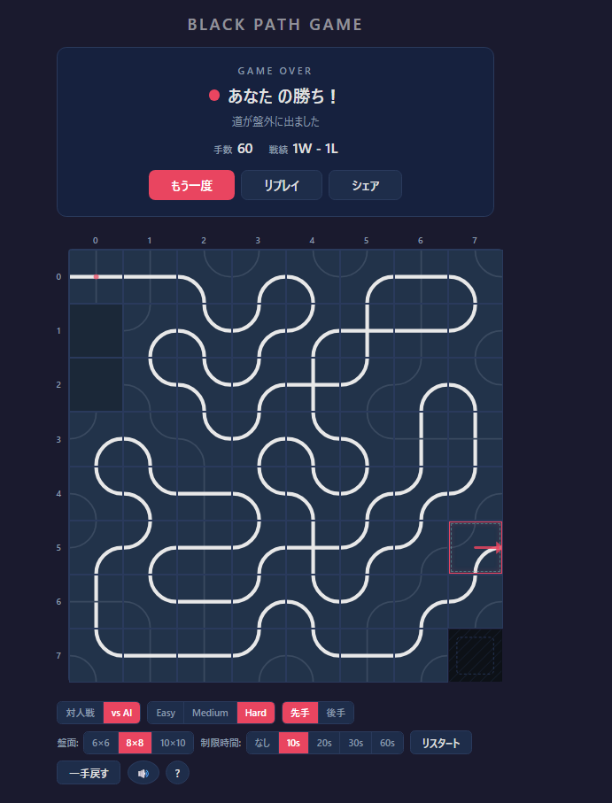

# Black Path Game

ブラウザで遊べる 2 人対戦パズルゲーム「**Black Path Game**」の実装です。
Truchet タイルを交互に置いて道を延ばし、相手を盤外に追い出せば勝ち。



---

## 遊び方

### 基本ルール

1. **8×8（6×6 / 10×10 も選択可）** のグリッド盤面でプレイします
2. 左上 (0,0) にあらかじめ **十字タイル** が配置されています
3. 右下の角は **欠損マス**（タイルを置けない穴）です
4. 2 人のプレイヤーが **交互にタイルを 1 枚ずつ** 道の先端に置いていきます
5. 自分が置いたタイルによって道が **盤外** または **欠損マス** に出てしまったプレイヤーの **負け** です

### タイルの種類

3 種類のタイルがあり、それぞれ 2 本の経路を持っています。
どのタイルも 4 辺すべてをカバーしているため、どの方向から入っても必ず出口があります。

| タイル | 説明 |
|--------|------|
| **曲線 (左上)** | 上↔左、下↔右 を弧で結ぶ |
| **曲線 (右上)** | 上↔右、下↔左 を弧で結ぶ |
| **十字** | 上↔下、左↔右 を直線で結ぶ |

### 自動追従（Auto-follow）

道の先にすでにタイルが置かれている場合、経路が自動的に追従されます。
追従はアニメーション付きでステップごとに表示されます。

### 操作方法

| 操作 | 説明 |
|------|------|
| 光っているマスをクリック | タイルピッカーを開く |
| `1` `2` `3` キー | タイルを即選択（ピッカー不要） |
| `Esc` | タイル選択をキャンセル |
| `Ctrl+Z` / `Cmd+Z` | 一手戻す |

---

## 機能一覧

### ゲームモード

- **対人戦 (PvP)** — ローカル 2 人対戦
- **vs AI (PvE)** — 3 段階の AI と対戦
  - **Easy** — ランダム手
  - **Medium** — 固定深さ 6 のミニマックス探索
  - **Hard** — 反復深化 + アルファベータ枝刈り（3 秒の思考時間）

### 先手/後手選択

PvE モードでは先手・後手を選べます。

### 盤面サイズ

**6×6** / **8×8**（デフォルト）/ **10×10** から選択できます。

### 制限時間

1 手あたりの制限時間を **なし / 10s / 20s / 30s / 60s** から設定できます。
残り 5 秒以下になると赤くパルスし、警告音が鳴ります。
時間切れで自動的に負けになります。

### 効果音

- タイル配置音
- タイマー警告音（残り 5 秒以下で毎秒）
- 勝利ジングル / 敗北サウンド
- ミュートボタン (🔊 / 🔇) でオン・オフ切替

### リプレイ

ゲーム終了後に「リプレイ」ボタンで対局を最初から再生できます。

- ◀ / ▶▶ でステップ送り
- ▶ で自動再生
- 進行状況の表示（例: 5 / 12）

### 戦績記録

対戦モード × AI 難易度ごとに勝敗が `localStorage` に保存されます。
結果画面に `W - L` の形式で表示されます。

### 結果シェア

ゲーム終了後の「シェア」ボタンで結果をクリップボードにコピーできます。

```
Black Path Game
8×8 | 23手
勝者: あなた（道が盤外に出ました）
戦績: 5W - 3L
```

### UI/UX

- **ダークテーマ** — 目に優しいダークカラースキーム
- **インラインタイルピッカー** — 選択マスの近くにポップアップ表示
- **タイル配置アニメーション** — ポップイン効果
- **パスヘッド表示** — 道の先端をハイライト
- **ゲームオーバー矢印** — 盤外に出た方向を矢印アニメーションで表示
- **AI 思考中表示** — スピナー付きの「考え中…」インジケーター
- **手数 / 残りマス** — ステータスバーにリアルタイム表示
- **ヘルプモーダル** — `?` ボタンでルール説明を表示

---

## 技術スタック

| カテゴリ | 技術 |
|----------|------|
| フレームワーク | React 19 + TypeScript 5.9 |
| ビルドツール | Vite 8 |
| テスト | Vitest |
| スタイリング | CSS Modules + CSS Custom Properties |
| 描画 | SVG（タイル・パス・矢印） |
| サウンド | Web Audio API（合成音、音声ファイル不要） |
| 永続化 | localStorage（戦績記録） |
| AI | ミニマックス + アルファベータ枝刈り + 反復深化 |

## プロジェクト構成

```
src/
├── game/                  # ゲームロジック（React 非依存）
│   ├── types.ts           # 型定義（GameState, Move, Board, etc.）
│   ├── constants.ts       # 盤面定数、タイル経路定義
│   ├── rules.ts           # 座標判定、タイル経路計算
│   ├── engine.ts          # 状態生成、手の適用、終了判定
│   ├── moveGenerator.ts   # 合法手の列挙
│   ├── ai.ts              # AI（Easy/Medium/Hard）
│   ├── index.ts           # 公開 API
│   └── __tests__/         # ユニットテスト
├── components/            # UI コンポーネント
│   ├── GameBoard.tsx      # 盤面（グリッド + インラインピッカー）
│   ├── Cell.tsx           # セル描画（SVG タイル + 矢印）
│   ├── TilePicker.tsx     # タイル選択ポップアップ
│   ├── HUD.tsx            # ステータスバー + 結果カード + リプレイ
│   ├── ControlPanel.tsx   # 設定パネル（モード, AI, 盤面サイズ, etc.）
│   ├── HelpModal.tsx      # ルール説明モーダル
│   └── tileSvg.ts         # SVG ヘルパー（円弧パス生成）
├── hooks/
│   ├── useRecord.ts       # 戦績の永続化
│   └── useSound.ts        # Web Audio API サウンド
├── App.tsx                # アプリルート（状態管理）
├── App.css
├── index.css              # グローバルスタイル + CSS 変数
└── main.tsx               # エントリーポイント
```

---

## セットアップ

```bash
# 依存パッケージのインストール
npm install

# 開発サーバーの起動
npm run dev

# ビルド
npm run build

# テストの実行
npx vitest run

# リント
npm run lint
```

---

## AI の仕組み

### Easy
完全ランダムに合法手を選択します。

### Medium
**固定深さ 6** のミニマックス探索 + アルファベータ枝刈り。
評価関数は盤面位置（端からの距離・欠損マスへの近さ・出口方向）を考慮します。

### Hard
**反復深化（Iterative Deepening）** + アルファベータ枝刈りで **3 秒間** 探索します。

- 前回の反復のスコアで手の並び替え（Move Ordering）を行い、枝刈り効率を最大化
- 分岐因子が 3 と小さいため、非常に深い読みが可能
- 強制勝ち/負けを発見すると即座に探索を打ち切り

評価ヒューリスティクス:
- 盤端への距離（近いほど危険）
- 欠損マス (N-1, N-1) への距離
- 出口方向が向いている先の残りマス数
- コーナー近接ペナルティ
- エッジセルペナルティ

---

## ライセンス

MIT
